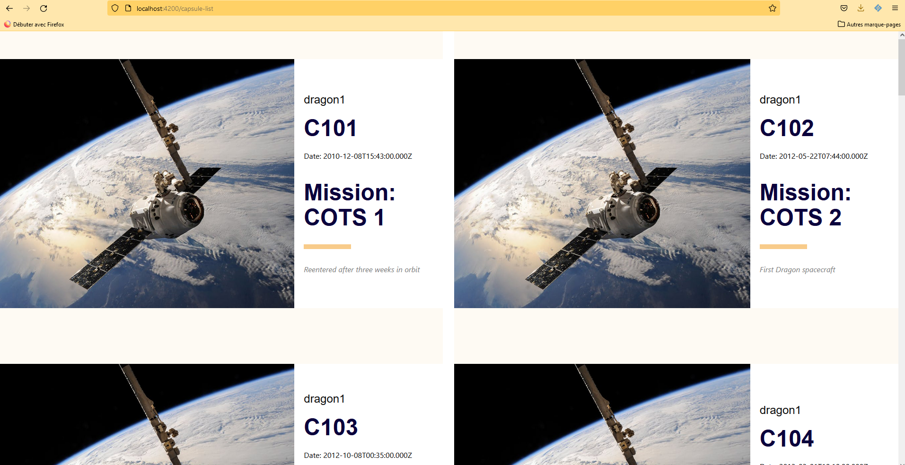
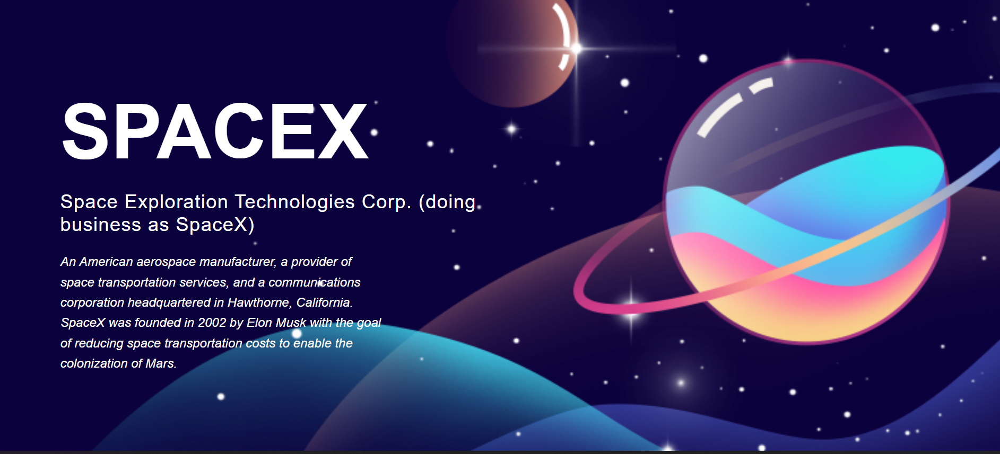
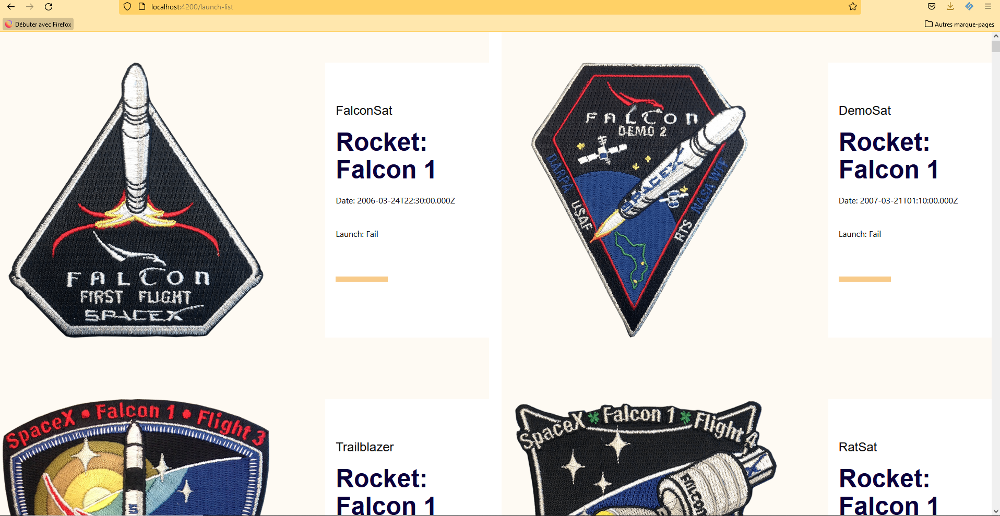

# Spacex

This project was created withe Space X Api. The objective is to display the launches and the capsules of this API.

# Mock-up Application




## URL

`localhost:4200`

## Launch docker

```docker-compose up --build```

## Start docker

```docker-compose start```

## Remove container

```docker-compose down```

## Show container logs

```docker-compose logs -f```

## Access to docker

```docker-compose exec ng /bin/sh```

## Create a component

```docker-compose exec ng ng generate component myComponent```

## Create a service

```docker-compose exec ng ng generate service myService```